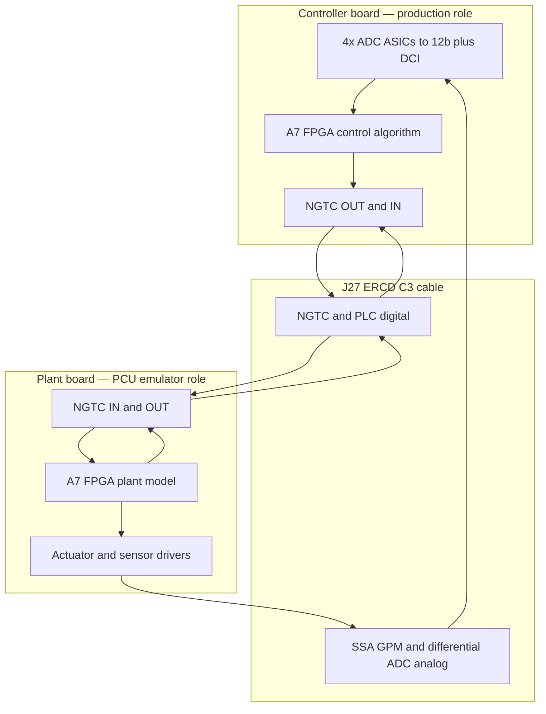

# Two-board HIL (600-00749)

Hardware-in-the-loop setup: one board runs the **production controller**; a second board emulates the **PCU / plant side** and closes the loop through the same **Converter Control (C3) interface** used in the field.

Reference schematic: `600-00749` (rev 0101).

---

## What is on each board (from schematic)

| Block | Part / sheet | Role in HIL |
|-------|----------------|-------------|
| **A7 FPGA** (Ares SOM) | P09–P11, P15–P17 | Controller DUT algorithm; plant dynamics and I/O on emulator board |
| **GPM0 / GPM1** SwiftB ASICs | P09–P11 | 12-bit parallel data + `DCI` clock into FPGA; analog front-end `A0`–`A7`, SSA, PV/VIN buffers |
| **ITANK ADC** Kestrel | P06 | Differential sensor channel into FPGA (via translators, sheet P13) |
| **PLC ADC** Kestrel | P07, P08 | Differential PLC channel + local AFE |
| **ADC Controller** KestrelC | P04–P05 | Configures all four ADC ASICs (SPI for ITANK/PLC, UART for GPM0/1); USB; holds ADCs in reset until `FPGA_CLK_PRESENT_N` |
| **NGTC** digital I/O | P14, J27 | 20 outputs (`NGTC_OUT0`–`19`), 8 inputs (`NGTC_IN0`–`7`), level-translated to FPGA |
| **J27** ERF8-030-05.0-L-DV-L | P12 | **Primary loop connector** — maps C3 “PCU DUT ↔ board” signals |
| **J28 jumpers** | P14 | `NGTC_DIG_OUT_EN` / `NGTC_DIG_IN_EN` — route NGTC through J27 when populated |

Four “ADC chips → 12-bit + clock → FPGA” paths are **GPM0, GPM1, ITANK, and PLC**, each with a 25 MHz clock net (`GPM0_CLK25`, `GPM1_CLK25`, `ITANK_CLK25`, `PLC_CLK25`).

---

## Controller PWM on J27 (sheet P12)

In production the control algorithm drives **converter PWMs at ~100 kHz** (duty / timing as implemented in the A7 FPGA) onto the **NGTC outbound** nets, which appear on **J27** as **`NGTC_OUT0`–`NGTC_OUT19`** (odd-side C3 pins on sheet P12, e.g. `NGTC_OUT0 14` … `NGTC_OUT19 14`). Those signals go to the converter / PCU through the ERCD cable.

For two-board HIL this path is the main **actuator** channel:

- **Controller board** keeps the **production output** behavior: FPGA drives `A7_NGTC_OUT*` → level shifters → `NGTC_OUT*` → J27.
- **Plant board** can **use the same cable pins as inputs** to recover the PWM stream (capture duty cycle, phase, dead time) and feed the plant model—no separate “NGTC_IN only” path required for actuation if the loop mirrors production mapping.

Plant-side firmware typically decimates or averages over switching periods to produce the slow **plant input** `u[k]` at control rate `Ts`, while still sampling the ~100 kHz waveform for fidelity checks.

---

## NGTC level shifters (sheet P14) and HIL pin direction

Sheet **P14** translates between the FPGA **1.2 V / 1.8 V** domain (`A7_NGTC_*`, bank notes on schematic) and the **NGTC connector / J27** side (`NGTC_OUT*`, `NGTC_IN*`, often 3.3 V domains). Parts such as **U49**, **U50**, **U52**, and related **TXV0106** devices are **unidirectional** (designed for **FPGA → J27** on the outbound channels):

```text
  Production (controller) — NGTC drive
  A7 FPGA pad (output) ──► A7_NGTC_OUTn ──► U49 / TXV0106 ──► NGTC_OUTn ──► J27 ──► cable
```

You **cannot rely** on driving **`NGTC_OUTn` at J27** and reading a valid level back through **TXV0106** into the FPGA—the translator channel is not meant to pass signals **J27 → FPGA** on those nets.

### Plant board: reuse `A7_NGTC_OUT*` nets as FPGA inputs

On the **plant emulator** board, a practical HIL approach (as you outlined):

1. Route controller PWMs from the ERCD cable onto the same **`NGTC_OUTn`** nets that, on a production image, originate at J27 after the translators.
2. Load a **HIL-only FPGA image** that assigns the corresponding **`A7_NGTC_OUT0` … `A7_NGTC_OUT19`** pads as **inputs** (not outputs).
3. Sample / measure PWM in the plant FPGA (IOPLL timing, oversample, or duty counter) and run the plant model.

Electrically, the intent is to present the cable-driven PWM on the **FPGA-side net** `A7_NGTC_OUTn` **without depending on reverse conduction through U49-class shifters**. Options to confirm on the bench:

- **Tie / isolate** the outbound translator so it does not fight the incoming cable driver (HIL bitstream keeps FPGA in input mode; validate whether series resistors—e.g. 33 Ω on P14— and disabled paths are enough, or whether a build variant keeps `NGTC_DIG_OUT_EN` / related jumpers **off** for those channels).
- Use **P14 logic-analyzer headers** and test points to verify levels and edge rate at ~100 kHz before closing the loop.
- Prefer **direct FPGA input** at **`A7_NGTC_OUTn`** over attempting to read **`NGTC_IN0`–`7`** if the production actuators use the full **OUT0–19** PWM set on J27.

**Return path (plant → controller)** still uses the **`NGTC_IN`** / **`A7_NGTC_IN*`** path (separate translators, e.g. **U53** / **U54** region on P14, enabled with **`NGTC_DIG_IN_EN`** via **J28** when routed through J27)—direction matches **PCU → board** in production.

| Signal group | Production direction | Controller HIL | Plant HIL |
|--------------|---------------------|----------------|-----------|
| `NGTC_OUT0–19` / `A7_NGTC_OUT*` | FPGA → J27 → converter | Output (production bitstream) | **Input** (HIL bitstream); PWM sense |
| `NGTC_IN0–7` / `A7_NGTC_IN*` | J27 → FPGA | Input | Output (if digital feedback used) |

---

## Back-to-back topology

Use the **approved ERCD cable** family documented on sheet P12 (Samtec ERCD-030, pin 1 to pin 1). In production:

- **1st end** = PCU DUT  
- **2nd end** = board  

For HIL, assign roles explicitly:

```text
  ┌─────────────────────────────┐         ERCD C3 cable          ┌─────────────────────────────┐
  │  Board — CONTROLLER         │  board end (2nd) ◄────────────► │  Board — PLANT EMULATOR     │
  │  (production FPGA + FW)     │         J27                    │  (plant model FPGA + FW)    │
  │                             │                                │  wired as PCU DUT (1st end) │
  │  NGTC_OUT* (~100 kHz PWM) ──┼───────────────────────────────►│  same nets → FPGA inputs    │
  │  NGTC_IN* ◄─────────────────┼────────────────────────────────│  NGTC_OUT* (digital fb)     │
  │  A0..A7, SSA, ITANK, PLC    │                                │  drives PCU-side analog    │
  │  ◄── analog “sensors” ──────┼────────────────────────────────│  and comm pins              │
  └─────────────────────────────┘                                └─────────────────────────────┘
```



**Controller board**

- Run the **same** bitstream/firmware you ship (only non-invasive HIL hooks if needed: logging, test mode).
- KestrelC must be running so ADC ASICs leave reset and configure over SPI/UART as in production.
- Populate **J28** if NGTC on the loop must pass through J27 (per sheet P14 note: “insert jumper to enable NGTC thru PCU DUT connector”).

**Plant emulator board**

- FPGA (and optional host via KestrelC USB) runs **fixed-step plant dynamics** at the control sample rate.
- Reads **actuation** by capturing **~100 kHz PWM** on **`NGTC_OUT0–19`** / **`A7_NGTC_OUT*`** (HIL inputs), not by reversing the **U49 / TXV0106** outbound translators.
- Writes **sensor** values the controller expects on the **even-side C3 analog / feedback** nets (`A0_GPM0` … `A7_GPM0`, GPM1 equivalents, `SSA_P/N`, `ITANK_CS_P/N`, `PCU_PLC_P/N`, etc. — see J27 pin table on sheet P12).

Mechanical: follow the schematic warning — pick ERCD 1st-end option (TEU/TED/TBL) for clearance; PEM/screw notes on J27 apply.

---

## Can the second board be the plant?

**Yes — that is the right use of a second board**, but the split of labor matters:

| Plant function | Second board | Notes |
|----------------|--------------|--------|
| Digital actuation → plant | **Native (with HIL pin dir)** | ~100 kHz PWM on J27 **`NGTC_OUT*`**; plant FPGA samples **`A7_NGTC_OUT*`** as inputs; do not rely on uni-directional shifters (U49-class) in reverse. |
| Digital feedback → controller | **Native** | Plant drives `NGTC_OUT*` → controller `NGTC_IN*`. |
| Analog sensors → controller ADCs | **Not native on Swift pins** | Swift `VIN`/`A0`–`A7` are **ADC inputs**, not DACs. Emulator must **source voltages** onto the PCU-side cable pins. |
| 12-bit + clock fidelity on controller | **Native on controller** | Controller still uses real GPM/ITANK/PLC ASICs — good HIL fidelity. |
| PLC comm (`PCU_PLC_*`) | **Protocol emulator** | If production uses PLC serial on the cable, plant FPGA (or KestrelC) implements PCU-side behavior. |

So: the second board is the **plant brain** (FPGA) plus **digital I/O** through the existing NGTC path; **analog plant outputs** need an explicit **actuator/sensor emulation layer** on the plant side (see below).

---

## Software framework (recommended layers)

1. **Signal dictionary**  
   Map every production signal to: C3 pin / NGTC index / ADC channel, units, range, LSB size (12-bit), sample period `Ts`, transport delay.

2. **Time base**  
   Align plant step with ADC sampling (`GPMx_DCI_CLK`, Kestrel streams, 25 MHz clock domains). For PWM actuation, document capture latency (~100 kHz edges vs control `Ts`) and cable delay. Document fixed latency: cable + any DAC/filter on plant (not reverse through TXV0106 on OUT paths).

3. **Controller DUT image**  
   Unmodified production build; KestrelC release that configures ADCs when FPGA clock is present.

4. **Plant runtime (emulator board)**  
   - Input: NGTC (and PLC RX if used).  
   - State update: `x[k+1] = f(x[k], u[k])`.  
   - Output: digital NGTC + **analog voltage commands** for each emulated sensor.

5. **Analog output adapter (plant board)**  
   Convert plant state to voltages at C3 scaling (bandgap references `BG_GPM0` / `BG_GPM1` on sheet P12 — GPM channels are referenced to per-ASIC bandgap).

6. **Supervisor (host)**  
   USB to either KestrelC: start/stop scenarios, load parameters, log controller + plant states, estop.

7. **Safety**  
   Clamp all emulated analog pins; watchdog on NGTC; independent power estop.

---

## Additional components (beyond two boards + ERCD cable)

### Required for a closed loop

| Item | Why |
|------|-----|
| **ERCD-030 cable** (correct TEU/TED orientation per P12) | J27 ↔ J27; defines NGTC and analog pin mapping |
| **J28 jumpers** (both boards if NGTC via J27) | Enable NGTC through PCU DUT connector (P14) |
| **Analog voltage sources on plant side** | Drive `A0`–`A7`, SSA, ITANK, PLC differential inputs — Swift ASICs on the plant board do not act as DACs |
| **Common ground reference** | Single-point or defined ground via cable; both boards powered with compatible grounds |
| **Two supplies / power-up sequence** | KestrelC and `FPGA_CLK_PRESENT_N` sequencing per P04 notes |

### Practical analog emulation options (pick one)

1. **Pmod DAC(s)** (P21–P22) on plant board + precision op-amps scaling to sensor full-scale — lowest risk for first bring-up.  
2. **Small external analog output rack** (multi-channel DAC) wired to C3 analog pins on a **breakout** that mimics PCU drive.  
3. **Digital-only loop (partial HIL)** — NGTC only, inject synthetic ADC data in a **non-production** controller build (bypasses real 12-bit path; use only for early algorithm work).

### Strongly recommended

| Item | Why |
|------|-----|
| **Breakout / PCU pin fixture** (740-02205 context on J27) | Probe, calibrate, and limit analog levels |
| **Scope + logic analyzer** (P14 optional LA header) | Verify NGTC timing and DCI |
| **Calibration procedure** | Measure ADC code vs applied voltage per channel on controller board |
| **Documented `Ts` and transport delay** | Stability margins must match production sampling |

### Optional

- Shared **25 MHz** reference (schematic notes external 25 MHz for debug on clock sheet) if you need phase alignment beyond fixed-delay plant model.  
- Optical / SOM debug (P19–P20) for high-speed FPGA trace.  
- Fault injection: offset/stuck NGTC bit, drop ADC sample, noise on one analog channel.

---

## Bring-up sequence (suggested)

1. Power controller only; KestrelC configures ADCs; confirm FPGA reads sensible idle ADC codes.  
2. Loopback **digital only**: on plant board, apply a known ~100 kHz PWM at one **`NGTC_OUT`** / **`A7_NGTC_OUT*`** input; validate duty measurement.  
3. Connect ERCD; plant board drives **one** analog channel (e.g. `A0_GPM0`) with a known DC level; confirm controller ADC code.  
4. Close full plant model at fixed `Ts`; compare step responses to offline simulation.  
5. Regression suite via host supervisor.

---

## Open items to resolve from your control design

- Which signals are **NGTC-only** vs **GPM/ITANK/PLC analog** in the real loop?  
- Whether **PLC serial** on `PCU_PLC_P/N` is in the hot path or configuration-only.  
- Target sample rate and acceptable HIL latency (ms) for stability tests.  
- Exact ERCD part number and length for your mechanical setup (P12 options).

Once those are fixed, the signal dictionary (layer 1) can be turned into a pin-level test matrix for this repo.
