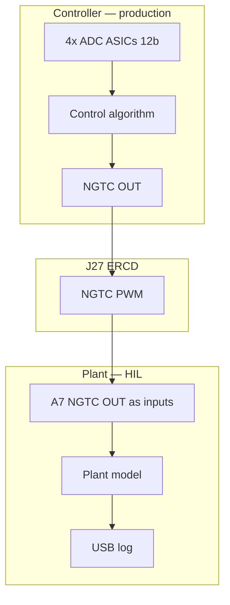

# Two-board HIL with Pheasant4 (600-00749)

Hardware-in-the-loop setup: one Pheasant4 runs the **production controller**; a second Pheasant4 emulates the **PCU / plant side** through the same **Converter Control (C3) interface** used in the field.

Reference schematic: `600-00749_pheasant4.pdf` (rev 0101).

**Recommended approach:** start with **digital-only HIL (M1)** — two boards, one J27 cable, HIL FPGA on the plant board, minimal extra parts. Add analog feedback later (M2/M3) only when you need real 12-bit ADC closure on the controller.

---

## Recommended implementation plan

### M1 — Digital-only (primary plan)

Reuse two Pheasant4 boards with **minimum part changes**.

| Role | Hardware | Software |
|------|----------|----------|
| **Controller** | Production Pheasant4 | **Production** FPGA bitstream + KestrelC ADC bring-up |
| **Plant simulator** | Second Pheasant4 | **HIL-only** FPGA bitstream (not shipping control law) |
| **Link** | **ERCD cable** between **J27** on both boards | — |
| **Debug** | USB to each KestrelC; optional **oscilloscope** on PWM | Host logs plant states, duty, scenarios |

**What runs in the loop**

- Controller outputs **~100 kHz converter PWM** on **`NGTC_OUT0–19`** → J27 → cable.
- Plant FPGA reads PWM via **`A7_NGTC_OUT0–19` configured as inputs** (see [NGTC level shifters](#ngtc-level-shifters-sheet-p14-and-hil-pin-direction)), decodes duty, runs **`x[k+1] = f(x[k], u[k])`**, logs **`u`**, **`x`**, faults over USB.

**What is not in the loop yet**

- Real **sensor voltages** into the controller’s Swift / Kestrel ADCs. The controller may not behave like the field if it **requires ADC feedback** to regulate; M1 still validates **production PWM timing → plant model**.

**M1 shopping / bench list**

| Item | Required for M1? |
|------|------------------|
| Second Pheasant4 | Yes |
| ERCD cable for J27 (sheet P12) | Yes |
| J28 jumpers (NGTC through J27, sheet P14) | Usually yes for PWM on the cable |
| HIL plant FPGA image | Yes (developed in-repo) |
| USB cables | Yes |
| Oscilloscope or logic analyzer | Optional (first power-on check) |
| Pmod DAC, multi-DAC, fixture | No |

### M2 — One analog feedback channel

Add a **Pmod DAC** (P21–P22) on the **plant** board: FPGA sets one voltage → controller sees one real **12-bit ADC** code on a single J27 analog net (e.g. one `A0_GPM0`-class signal). Smallest step toward closing the analog loop.

### M3 — Full analog HIL

**Multi-channel DAC** (many analog outputs) plus a **fixture** (breakout harness, test points, clamps) to drive all GPM / SSA / ITANK / PLC feedbacks the controller expects. Used for regression matching field wiring.

---

## Glossary (bench terms)

| Term | Plain meaning |
|------|----------------|
| **ERCD cable** | The **Samtec cable family** on schematic sheet **P12** that mates **J27** (ERF8 connector). It is the normal **PCU ↔ Pheasant4** cable; for HIL you use it **Pheasant4 ↔ Pheasant4** (controller on “Pheasant” end, plant on “PCU DUT” end). |
| **Scope** | A **bench oscilloscope** (or logic analyzer). Used to **confirm PWM** (~100 kHz, levels) on first bring-up — lab equipment, not a permanent HIL part. |
| **Pmod DAC** | A **small plug-in module** on the board’s **Pmod** connectors (P21–P22): FPGA writes a code → module outputs a **real voltage**. One module = a few channels; enough for **M2**. |
| **Multi-DAC** | A **many-channel DAC** board or instrument (8–16+ outputs) to emulate **all** sensor voltages at once — **M3**. |
| **Fixture** | **Adapter hardware** for safe, repeatable testing: breakout from J27 to labeled test points, strain relief, optional series limiters — **not** required for M1 if the ERCD plugs directly into both J27 connectors. |

---

## Plant simulator framework (second Pheasant4)

Layers implemented on the **plant** board (M1 emphasizes layers 1–4 and 7; layer 5–6 grow in M2/M3):

| Layer | Plant board responsibility |
|-------|----------------------------|
| **1. Signal dictionary** | Per signal: J27 / C3 pin, NGTC index, units, control period `Ts`, delays. |
| **2. Time base** | PWM capture at ~100 kHz → plant input **`u[k]`** at **`Ts`** → state update before controller’s next sample window. |
| **3. Actuation in** | HIL bitstream: **`A7_NGTC_OUT*`** as **inputs**; duty / phase decode (do not rely on U49 / TXV0106 in reverse). |
| **4. Plant dynamics** | Fixed-step **`f(x,u)`** on A7 FPGA. |
| **5. Sensor out (analog)** | M2/M3: voltages on J27 nets the controller ADCs digitize — **not needed for M1**. |
| **6. Digital feedback (optional)** | Drive **`NGTC_IN` / `A7_NGTC_IN*`** toward controller if production uses it; **J28** `NGTC_DIG_IN_EN` when routed via J27. |
| **7. Supervisor + safety** | KestrelC USB: scenarios, logs, estop; watchdog on invalid PWM / plant state. |

```text
M1 data flow (digital-only):

  Controller:  FPGA → NGTC_OUT* → J27 ── ERCD ── J27 → plant side nets
  Plant:       A7_NGTC_OUT* (inputs) → PWM decode → u[k] → f(x,u) → log x[k] (USB)
               (optional later) NGTC_IN* back to controller
               (M2+) analog voltages → controller ADCs
```

The **controller** Pheasant4 always runs the **shipping control algorithm**. The **plant** Pheasant4 runs a **different FPGA image** only.

---

## What is on each board (from schematic)

| Block | Part / sheet | Role in HIL |
|-------|----------------|-------------|
| **A7 FPGA** (Ares SOM) | P09–P11, P15–P17 | Controller DUT algorithm; plant dynamics and I/O on emulator board |
| **GPM0 / GPM1** SwiftB ASICs | P09–P11 | 12-bit parallel data + `DCI` clock into FPGA; analog front-end `A0`–`A7`, SSA, PV/VIN buffers |
| **ITANK ADC** Kestrel | P06 | Differential sensor channel into FPGA (via translators, sheet P13) |
| **PLC ADC** Kestrel | P07, P08 | Differential PLC channel + local AFE |
| **ADC Controller** KestrelC | P04–P05 | Configures all four ADC ASICs (SPI for ITANK/PLC, UART for GPM0/1); USB; holds ADCs in reset until `FPGA_CLK_PRESENT_N` |
| **NGTC** digital I/O | P14, J27 | 20 outputs (`NGTC_OUT0`–`19`), 8 inputs (`NGTC_IN0`–`7`), level-translated to FPGA |
| **J27** ERF8-030-05.0-L-DV-L | P12 | **Primary loop connector** — maps C3 “PCU DUT ↔ Pheasant4” signals |
| **J28 jumpers** | P14 | `NGTC_DIG_OUT_EN` / `NGTC_DIG_IN_EN` — route NGTC through J27 when populated |

Four “ADC chips → 12-bit + clock → FPGA” paths are **GPM0, GPM1, ITANK, and PLC**, each with a 25 MHz clock net (`GPM0_CLK25`, `GPM1_CLK25`, `ITANK_CLK25`, `PLC_CLK25`).

---

## Controller PWM on J27 (sheet P12)

In production the control algorithm drives **converter PWMs at ~100 kHz** onto **`NGTC_OUT0`–`NGTC_OUT19`** on **J27** (odd-side C3 pins on sheet P12). Those signals go to the converter / PCU through the ERCD cable.

For HIL:

- **Controller:** production path — `A7_NGTC_OUT*` → level shifters → `NGTC_OUT*` → J27.
- **Plant (M1):** same cable pins → plant **`A7_NGTC_OUT*`** as **inputs** → PWM decode → plant model.

Plant firmware typically averages over switching periods to form **`u[k]`** at **`Ts`** while still observing ~100 kHz edges for diagnostics.

---

## NGTC level shifters (sheet P14) and HIL pin direction

Sheet **P14** uses **unidirectional** translators (e.g. **U49**, **U50**, **U52**, **TXV0106**) for **FPGA → J27** on outbound NGTC:

```text
  A7 FPGA (output) ──► A7_NGTC_OUTn ──► U49 / TXV0106 ──► NGTC_OUTn ──► J27
```

Do **not** depend on driving **`NGTC_OUTn` at J27** and reading back through **TXV0106** into the FPGA.

**Plant HIL approach:**

1. Cable delivers controller PWM to plant **`NGTC_OUTn`** nets.
2. **HIL bitstream:** **`A7_NGTC_OUT0`–`19`** are **inputs**.
3. Capture in FPGA; validate on bench (P14 LA headers, scope).

Confirm on bring-up that outbound translators do not fight the cable when FPGA pads are inputs (**`NGTC_DIG_OUT_EN`**, series resistors on P14).

| Signal group | Production direction | Controller HIL | Plant HIL |
|--------------|---------------------|----------------|-----------|
| `NGTC_OUT0–19` / `A7_NGTC_OUT*` | FPGA → J27 | Output (production) | **Input**; PWM sense |
| `NGTC_IN0–7` / `A7_NGTC_IN*` | J27 → FPGA | Input | Output (optional digital fb) |

**Return path (optional):** plant → controller via **`NGTC_IN*`** / **`A7_NGTC_IN*`** and **`NGTC_DIG_IN_EN`** (J28).

---

## Back-to-back topology

Use the **approved ERCD cable** on sheet P12 (Samtec ERCD-030, pin 1 to pin 1):

- **1st end** = PCU DUT → **plant emulator** Pheasant4  
- **2nd end** = Pheasant4 → **controller** DUT  

```text
  ┌─────────────────────────────┐         ERCD cable           ┌─────────────────────────────┐
  │  Pheasant4 — CONTROLLER     │  Pheasant end (2nd) ◄───────► │  Pheasant4 — PLANT          │
  │  production FPGA + FW       │         J27                   │  HIL FPGA + plant model     │
  │  NGTC_OUT* (~100 kHz PWM) ──┼──────────────────────────────►│  A7_NGTC_OUT* as inputs   │
  │  NGTC_IN* ◄─────────────────┼───────────────────────────────│  (optional) NGTC feedback │
  │  ADCs ◄── analog (M2/M3) ───┼───────────────────────────────│  DAC / fixture (M2/M3)    │
  └─────────────────────────────┘                               └─────────────────────────────┘
```



**Controller:** same bitstream/firmware you ship; KestrelC configures ADCs when FPGA clock is present. **J28** if NGTC must pass through J27.

**Plant (M1):** HIL FPGA + USB logging; no analog drive required.

Mechanical: ERCD 1st-end option (TEU/TED/TBL) per sheet P12; PEM/screw notes on J27.

---

## Can the second Pheasant4 be the plant?

**Yes.** Split of labor:

| Function | Second Pheasant4 | M1 digital-only |
|----------|------------------|-----------------|
| PWM actuation → plant | **`A7_NGTC_OUT*`** inputs + decode | **Yes** |
| Plant dynamics | FPGA **`f(x,u)`** | **Yes** |
| Digital feedback → controller | **`NGTC_IN*`** path | Optional |
| Analog → controller ADCs | External **DAC** / fixture; Swift is not a DAC | **Deferred (M2/M3)** |
| 12-bit fidelity on controller | Real ADCs when analog driven | **Later** |

---

## Software framework (both boards)

1. **Signal dictionary** — C3 pin / NGTC / ADC channel, units, 12-bit LSB, `Ts`, delay.  
2. **Time base** — PWM at ~100 kHz vs plant **`Ts`**; document cable latency.  
3. **Controller DUT** — unmodified production build (M1).  
4. **Plant runtime** — inputs: PWM; state update; M2+ analog commands.  
5. **Analog adapter (M2+)** — plant state → voltages (`BG_GPM0` / `BG_GPM1` scaling, sheet P12).  
6. **Supervisor** — USB / KestrelC: scenarios, logs, estop.  
7. **Safety** — M1: PWM watchdog; M2+: clamp analog outputs.

---

## Additional components by phase

### M1 — digital-only

| Item | Why |
|------|-----|
| **ERCD-030 cable** (TEU/TED per P12) | J27 ↔ J27 |
| **J28 jumpers** | NGTC through J27 (P14) |
| **USB** | KestrelC on both boards |
| **Common ground / power-up** | Both boards powered; P04 sequencing |

### M2 — one analog channel

| Item | Why |
|------|-----|
| **Pmod DAC** (P21–P22) | One emulated sensor voltage |
| **Scope + calibration** | Voltage → ADC code on controller |

### M3 — full analog

| Item | Why |
|------|-----|
| **Multi-channel DAC** | All feedback nets |
| **Fixture / breakout** (J27 / 740-02205 context) | Probe, limit, repeatability |
| **Calibration procedure** | Per-channel ADC map |

### Optional (any phase)

- Shared **25 MHz** reference (clock sheet debug note).  
- Optical / SOM debug (P19–P20).  
- Fault injection (NGTC, ADC, analog offset).

---

## Bring-up sequence

### M1 (digital-only)

1. Power **controller** only; KestrelC configures ADCs; confirm production FPGA runs.  
2. Load **plant HIL** bitstream; confirm USB / idle state.  
3. Connect **ERCD**; **scope** (optional) on one **`NGTC_OUT`** at plant side — ~100 kHz, plausible duty.  
4. Run plant model: log **`u[k]`**, **`x[k]`** vs known PWM patterns (step duty, etc.).  
5. Compare plant output to offline simulation; add supervisor regression tests.

### M2 / M3 (when adding analog)

6. One **Pmod DAC** channel → one J27 analog net → verify controller ADC code.  
7. Expand channels and **fixture** as needed; close loop at **`Ts`** vs simulation.

---

## Open items

- Which loops need **ADC feedback** for the controller to run safely in M1 (open-loop vs limited modes)?  
- **NGTC-only** vs **GPM/ITANK/PLC analog** in production.  
- **PLC serial** on `PCU_PLC_P/N` — hot path or config-only?  
- Target **`Ts`**, HIL latency budget, exact **ERCD** part number and length (P12).

Once the signal dictionary is fixed, turn it into a pin-level test matrix in this repo.
